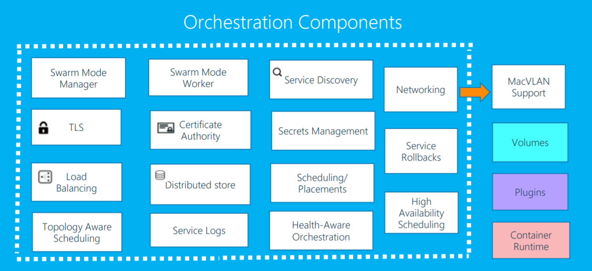
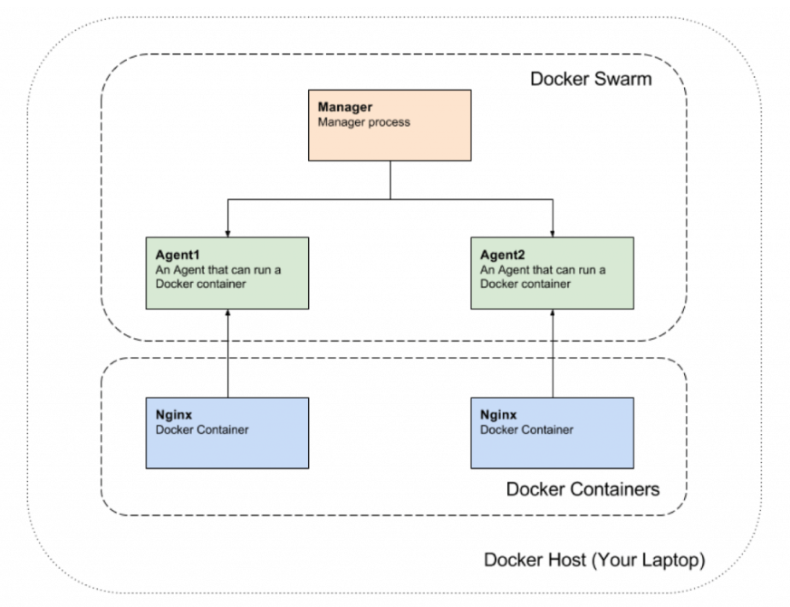

# Introduction to Swarm

- Docker Swarm is a container orchestration tool built and managed by ~~Docker, Inc~~. [Mirantis](https://www.blognone.com/node/113131)
- It is the native clustering tool for Docker.
Swarm uses the standard Docker API, i.e., containers can be launched using normal docker run commands and Swarm will take care of selecting an appropriate host to run the container on.
- The tools that use the Docker API—such as Compose and bespoke scripts—can use Swarm without any changes and take advantage of running on a cluster rather than a single host.

## Swarm vs Kubernetes

## Swarm architecture

## Refs

- http://dockerlabs.collabnix.com/intermediate/workshop/what-is-docker-swarm.html

- 