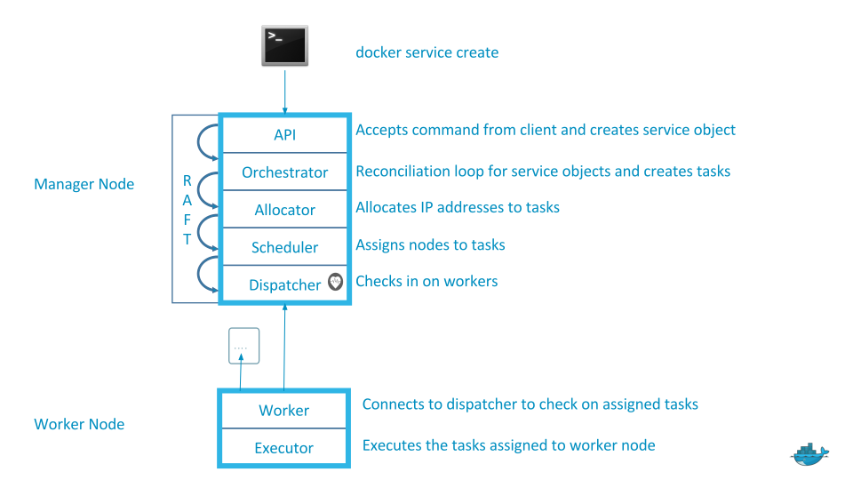

# Play with Service

- Single node -> `docker run ....`
- Swarm cluster -> `docker service ...`
- Service > Task > Container

### Deploy a new service

```
docker service create \
  --name=viz \
  --publish=8080:8080/tcp \
  --constraint=node.role==manager \
  --mount=type=bind,src=/var/run/docker.sock,dst=/var/run/docker.sock \
  dockersamples/visualizer
```

- Show service's task

node1$ < `docker service inspect viz`

- List all services

node1$ < `docker service ls`

- Show container running in service

node1$ < `docker service ps viz`

- Show log from container

node1$ < `docker service logs ps viz`

### Scale out service

node1$ < `docker service update viz --replicas=3`

- Check all running containers in `viz` service.

node1$ < `docker service ps viz`

## Task life cycle

- Task status
    - assigned (the task has been assigned to a specific node)
    - preparing (this mostly means "pulling the image")
    - starting
    - running

- When a task is terminated (stopped, killed...) it cannot be restarted. (A replacement task will be created)

### Lab 3. Kill a container

- Check running container from each manager nodes.

node1$ < `docker ps`

node2$ < `docker ps`

node3$ < `docker ps`

- Kill a container

node1$ < `docker kill {{Container ID}}`

- Check running container from `viz` service.

node1$ < `docker service ps viz`

## Docker service explaination



### Remove service

node1$ > `docker service rm viz`

### Lab 4. Create hello world service

**Requirements**
- Service name : `nginx-hello`
- Image name : `nginxdemos/hello`
- Publish port : `8081`
- Container port : `80`
- Run `2 replicas` on `worker` nodes

<!---
```
docker service create \
  --name=nginx-hello \
  --publish=8081:80/tcp \
  --replicas=2 \
  nginxdemos/hello
```
--->