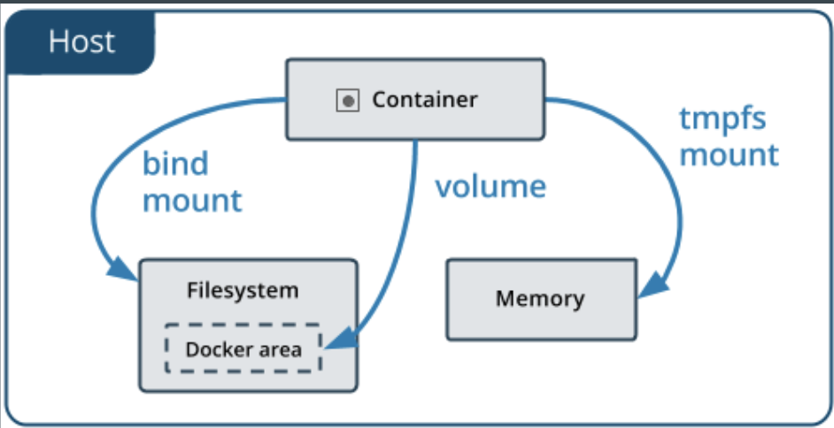

# Volume

## Volume docker area

### Create a docker volume

> `docker volume create myVolume`

> `docker volume ls`

> `docker volume inspect myVolume`

**Work only same host because default of volume is `local`**

### NTFS File sharing

- https://sysadmins.co.za/docker-swarm-persistent-storage-with-nfs/