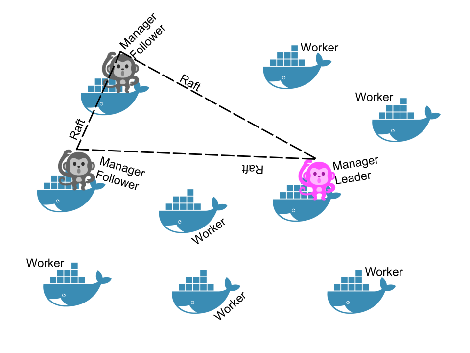

# Play with Swarm

### Create a first node
- Login >> https://labs.play-with-docker.com/
- Click `+ instance`
- Init docker swarm
node1$ > `docker swarm init`

```
Error response from daemon: could not choose an IP address to advertise since this system has multiple addresses on different interfaces ({{MACHINE IP}} on eth0 and 172.18.0.15 on eth1) - specify one with --advertise-addr
```

node1$ > `docker swarm init --advertise-addr {{MACHINE IP}}`

```
Swarm initialized: current node (xxxxx) is now a manager.

To add a worker to this swarm, run the following command:

    docker swarm join --token {{TOKEN}} {{MACHINE IP}}:2377

To add a manager to this swarm, run 'docker swarm join-token manager' and follow the instructions.
```

- List nodes in swarm cluster

node1$ > `docker node ls`

### Create second node

- Click `+ instance`
- Join swarm by token

node2$ > `docker swarm join --token {{TOKEN}} {{MACHINE IP}}:2377`

node2$ > `docker node ls`

```
Error response from daemon: This node is not a swarm manager. Worker nodes can't be used to view or modify cluster state. Please run this command on a manager node or promote the current node to a manager.
```

## Swarm node concept

- A cluster will be at least one node (preferably more)
- A node can be a manager or a worker
- A manager actively takes part in the [Raft consensus](https://docs.docker.com/engine/swarm/raft/), and keeps the Raft log
- You can talk to a manager using the SwarmKit API
- One manager is elected as the leader; other managers merely forward requests to it
- The workers get their instructions from the managers
- Both workers and managers can run containers




### Add more manager nodes
- Now `node1` is only one manager.
- If we lose it, we lose quorum - and that's very bad!
- If the manager is permanently gone, we will have to do a manual repair!
- Nobody wants to do that ... so let's make our cluster highly available

## Adding steps
- Click `+ instance`

- Run generate join token on manager node.

node1$ > `docker swarm join-token manager`

- Join from token.

node3$ > `docker swarm join --token {{TOKEN}} {{IP}}:2377`

- Check all nodes in swarm cluster.

node3$ > `docker node ls`

node1$ > `docker node ls`

### Lab 1. Create more nodes

| Nodes        |Manager|Worker |
| -------------|:-----:|:-----:|
| node1        |&#9745;|&#9744;|
| node2        |&#9744;|&#9745;|
| node3        |&#9745;|&#9744;|
| node4        |&#9744;|&#9745;|
| node5        |&#9745;|&#9744;|

### Changing the role of node

> `docker node promote nodeX` → make nodeX a manager

> `docker node demote nodeX` → make nodeX a worker

### Lab 2. Change role

| Nodes        |Manager|Worker |
| -------------|:-----:|:-----:|
| node1        |&#9745;|&#9744;|
| node2        |&#9745;|&#9744;|
| node3        |&#9745;|&#9744;|
| node4        |&#9744;|&#9745;|
| node5        |&#9744;|&#9745;|

## How many manager nodes?

- `2N+1` nodes / N = Failed node
- 1 manager = no failure
- 3 managers = 1 failure
- 5 managers = 2 failures
- 7 managers and more = now you might be overdoing it for most designs.

## Why not have all nodes be managers?
- With Raft, writes have to go to (and be acknowledged by) all nodes Thus, it's harder to reach consensus in larger groups
- Only one manager is Leader (writable), so more managers ≠ more capacity
- Managers should be < 10ms latency from each other

## How about large scale swarm?
- Keep managers in one region (multi-zone/datacenter/rack)
- Groups of 3 or 5 nodes: all are managers. Beyond 5, separate out managers and workers
- Groups of 10-100 nodes: pick 5 "stable" nodes to be managers
- Groups of more than 100 nodes: watch your managers' CPU and RAM 16GB memory or more, 4 CPU's or more, SSD's for Raft I/O
otherwise, break down your nodes in multiple smaller clusters
Cloud pro-tip: use separate auto-scaling groups for managers and workers

## Refs
- https://container.training/swarm-selfpaced.yml.html