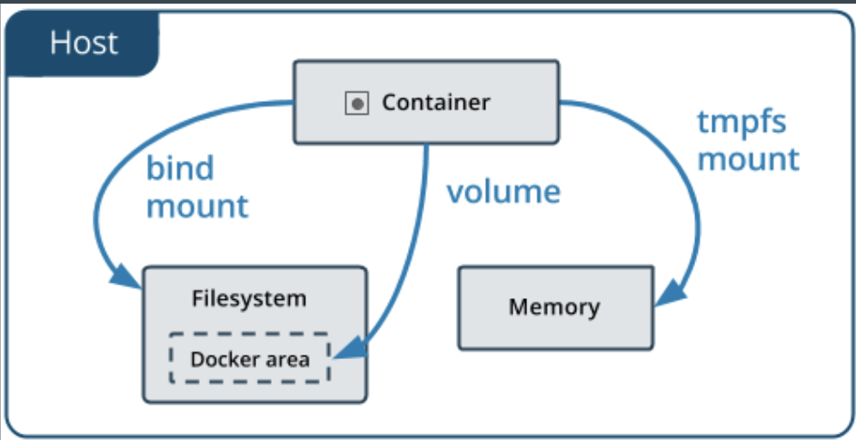

# Volume

## Volume docker area

### Create a docker volume

> `docker volume create myVolume`

> `docker volume ls`

> `docker volume inspect myVolume`

**Work only same host because default of volume is `local`**

## NTFS File sharing

- https://sysadmins.co.za/docker-swarm-persistent-storage-with-nfs/

### Create simmulation of nfs server

- create docker volume

> `docker volume create shared_data`

- run nfs server

>  `docker run -d --privileged -v shared_data:/nfsshare -e SHARED_DIRECTORY=/nfsshare -p 2049:2049 itsthenetwork/nfs-server-alpine`

- test mount folder from nfs to local

> `sudo apk add nfs-utils`

> `mkdir /nfs_share`

> `mount -v -t nfs4 -o vers=4,loud {{IP}}:/ /nfs_share`

- Command for testing nfs connection.

> `touch /nfs_share/hello.txt`

> `docker run -v /nfs_share:/shared -w /shared alpine touch hello_form_1.txt`

- List file from nfs server

> `docker ps`

> `docker exec {{Container Id}} ls /nfsshare`

### Lab X. Mount folder from another node

> `sudo apk add nfs-utils`

> `mkdir /nfs_share`

> `mount -v -t nfs4 -o vers=4,loud {{IP}}:/ /nfs_share`

**Tasks**
- Mount folder `nfs_share` on **all** nodes

### Lab Y. Deploy image upload app

**Requirements**
- Stack name : `upload`
- Service name : `php`
- Image name : `docker-workshop-php-upload`
- Publish port : `8085`
- Container port : `80`
- Volume path : `/var/www/html/files`
- Run `5 replicas` on all nodes