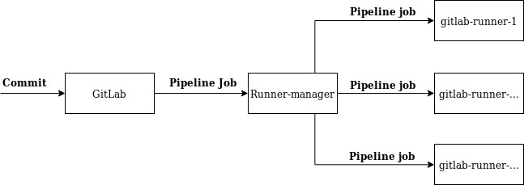

# CI/CD


# CD


# Gitlab setting

1. Register & login at https://gitlab.com/

2. Create new group and invite team.

3. Create new project from .

4. Find gitlab runner token (Settings -> CI/CD).



5. [Install gitlab-runner](https://docs.gitlab.com/runner/install/linux-repository.html)

6. Run gitlab-runner

```
sudo gitlab-runner register -n --name "ci-cd" --url "https://gitlab.com/" --registration-token "{{token}}" --executor docker --docker-image "docker:stable" --docker-volumes /var/run/docker.sock:/var/run/docker.sock
```

7. Disable `Shared Runners`

8. Add `.gitlab-ci.yml` to project.

**.gitlab-ci.yml**

```
image: docker:stable

before_script:
  - docker info

stages:
  - deploy

deploy_prod:
  only:
    - master
  stage: deploy
  script:
  - echo "$CI_BUILD_TOKEN" | docker login -u gitlab-ci-token --password-stdin registry.gitlab.com
  - docker pull $CI_REGISTRY_IMAGE:latest || true
  - >
      docker build
      --pull
      --cache-from $CI_REGISTRY_IMAGE:latest
      --tag $CI_REGISTRY_IMAGE:latest
      .
  - docker push $CI_REGISTRY_IMAGE:latest
  #- docker run --rm byrnedo/alpine-curl -X POST {{url to portainer}}
```
